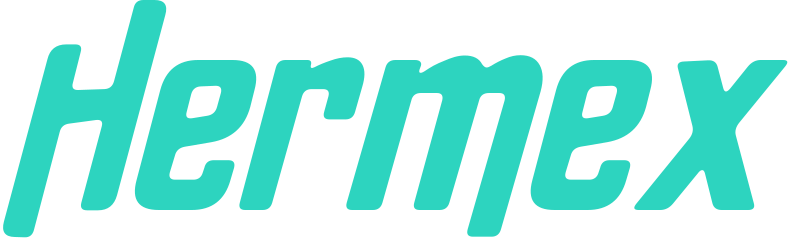

---
hide:
  - toc
---

<div class="hermex-hero">
  
  <p>
    <i>Drive ChatGPT and Gemini from Python — no API keys, no billing, just the free web UI.</i>
  </p>
  <div class="hermex-hero__buttons">
    <a href="installation/" class="md-button md-button--primary">Get started</a>
    <a href="quickstart/" class="md-button">Quickstart</a>
  </div>
</div>

---

ChatGPT and Gemini are incredibly capable — but their official APIs are expensive, and for many tasks you simply don't need them. If you want to run OCR on an image, generate artwork, extract text from a screenshot, or just ask a quick question in a script, paying per-token for API access is overkill when the free web UI can do the same thing.

Hermex lets you drive ChatGPT and Gemini from Python just like a human would: it opens a real Chrome browser, types your message, uploads your files, waits for the response, and hands it back to you as a Python object. No API keys, no billing, no rate-limit tiers.

```python
from hermex import ChatGPT

response = ChatGPT.simple_query("What does this receipt say?", attachments=["receipt.jpg"])
print(response.text)
```

---

## Why Hermex?

- **No API keys** — uses the same free web UI you already have access to
- **File support** — upload images, PDFs, CSVs, text files, and more; download AI-generated images
- **Bot detection evasion** — built on `undetected-chromedriver` with simulated human typing
- **Persistent sessions** — log in once, reuse the session across all future runs
- **Fluent interface** — chain method calls for clean, readable scripts
